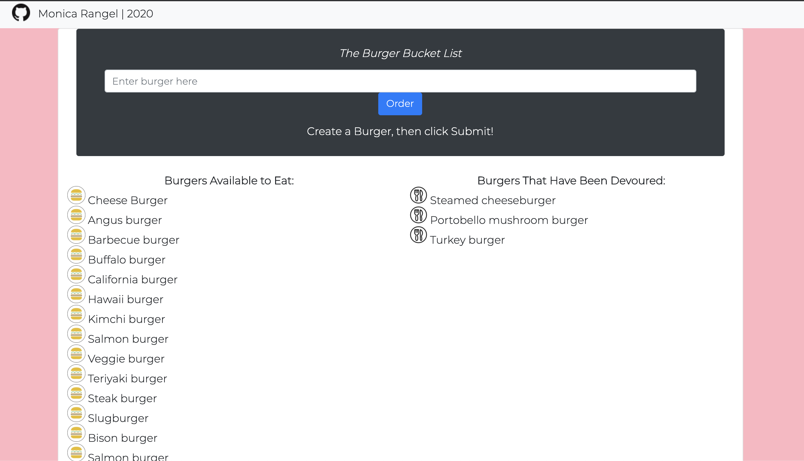

  # Burger-App
  
  ## Table of Contents
  - [Description](#description)
  - [Installation](#installation)
  - [Deployed Site](##DeployedSite)
  - [Usage](#usage)
  - [Contribution](#contribution)
  - [License](#license)
  - [Questions](#questions)
  ## Description
  Eat-Da-Burger! is a restaurant app that lets users input the names of burgers they'd like to eat.
## Deployed Site
https://afternoon-forest-25278.herokuapp.com/
 

  ## Installation
  npm install
  ## Usage
  * Whenever a user submits a burger's name, the app will display the burger on the left side of the page -- waiting to be devoured.
  * Each burger in the waiting area also has a `Devour it!` button. When the user clicks it, the burger will move to the right side of the page.

  ## License
  MIT License
  Copyright (c) [2020] [Monica Rangel]
  ## Questions
  - Github: https://github.com/monicarangel95
